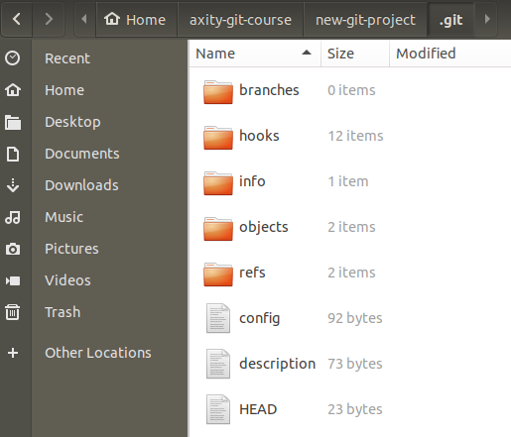

# Creando un Repositorio de Git

Antes de empezar a utilizar **Git**, es necesario que exista un repositorio.

Si recordamos:

> Un **repositorio** - es un directorio que contiene un proyecto, así como algunos archivos internos para la gestión y administración del propio proyecto de Git.

Para generar un repositorio de Git es necesario realizar las siguientes tareas:

 - Crear un directorio
- Inicializar el repositorio o clonar un repositorio remoto
 - Determinar el estatus de un repositorio

## Crear directorio

El primer paso es crear un directorio de archivos. Para esto se deben ejecutar los siguientes comandos:

    $ cd ~
    $ mkdir axity-git-course
    $ cd axity-git-course

    $ mkdir new-git-project
    $ cd new-git-project

Otra forma de hacerlo es ejecutando el siguiente comando:

    $ cd ~
    $ mkdir -p axity-git-course/new-git-project && cd $_

## Inicializar el repositorio

Inicializar un proyecto es una de las actividades más simples, basta con ejecutar el siguiente comando:

    $ git init

Al ejecutar el comando `git init` se generan todos los directorios y archivos necesarios que **Git** usará para mantener el control de versiones de todo.

Archivos/directorios en el directorio **.git**:

  - **config**: donde se guardan todos los ajustes de configuración específicos del proyecto, incluida la configuración inicial (nombre, e-mail). Ver la siguiente documentación para mayor detalle: [Git Book](https://git-scm.com/book/en/v2/Customizing-Git-Git-Configuration)

 - **description**: este archivo solo lo usa el programa GitWeb, por lo que puede ser ignorado

 - **hooks**: aquí es donde se pueden colocar scripts ya sea del lado del cliente o del servidor y que se pueden usar para conectar los diferentes eventos del ciclo de vida de Git

 - **info**: contiene el archivo de exclusión global

 - **objects**: almacena todos los **commits** realizados

 - **refs**: contiene apuntadores a los **commits**, básicamente a los "**branch**" y "**tags**"

## Clonando un repositorio

**¿A que nos referimos con clonar?**

> acción de obtener una copia idéntica

**¿Para qué serviría crear una copia idéntica?**

Cuando trabajamos en algún proyecto de desarrollo, por ejemplo, el desarrollo de una página web, siempre se ejecutan los siguientes pasos:

 -   crear un archivo `index.html`
 -   crear un directorio `js`
 -   crear un directorio `css`
 -   crear un directorio `img`
 -   crear un archivo `app.css` en el  directorio *css*
 -   crear un archivo `app.js` en el  directorio *js*
 -   agregar el código HTML inicial en `index.html`
 -   ...

Estos pasos se ejecutan cada vez que se inicia un nuevo proyecto, lo cual sería una tarea tediosa si debemos hacerlo desde cero. Lo más práctico es realizar una copia idéntica de un repositorio existente.

> Para clonar un repositorio usaremos el siguiente comando:
>
>     $ git clone <ruta del repositorio a clonar> <nuevo nombre del repositorio (opcional)>

Ejecutar el siguiente comando para clonar un repositorio:

    $ cd ~/axity-git-course
    $ git clone https://github.com/github/training-kit.git

## Determinar el estatus de un repositorio

El comando `git status` permite mostrar información sobre el estado de los archivos, directorio de trabajo y el repositorio.

Para ver el comportamiento de este comando, ejecutar lo siguiente:

    $ cd ~/axity-git-course/training-kit
    $ git status

La salida debería verse así:

    On branch master
    Your branch is up to date with 'origin/master'.

    nothing to commit, working tree clean

 - **On branch master**: indica la rama en la estamos situados actualmente. En este ejemplo, nos encontramos  en la rama **master**.
 - **Your branch is up to date with 'origin/master'.**: dado que previamente usamos **git clone** para hacer una copia de este repositorio, esto nos indica si nuestro proyecto está sincronizado con el repositorio que copiamos y que no existen cambios pendientes a sincronizar.
 - **nothing to commit, working tree clean**: indica que el directorio de trabajo está vacío/limpio, lo que significa que no hay cambios pendientes.

Ahora, ejecutar los siguientes comandos:

    $ cd ../axity-git-course/new-git-project/
    $ git status

Para el repositorio `new-git-project` la salida debería verse así:

    On branch master

    No commits yet

    nothing to commit (create/copy files and use "git add" to track)

 - **No commits yet (Initial commit** para versiones previas **)**: dado que este repositorio esta recién creado, esto indica que aún no tenemos **commits** registrados.
 - **nothing to commit (create/copy files and use "git add" to track)**: indica que el directorio de trabajo está vacío/limpio ya que es un repositorio recién creado e inicializado.

Ejecutar el siguiente comando dentro del repositorio `new-git-project`:

    $ git log

Esto debería generar la salida:

    fatal: your current branch 'master' does not have any commits yet
    axity (master) new-git-project

En este punto este mensaje no debería ser un problema ya que en este repositorio aún no existen **commits** que mostrar. En siguientes lecciones se verá con más detalle el comando `git log`.
