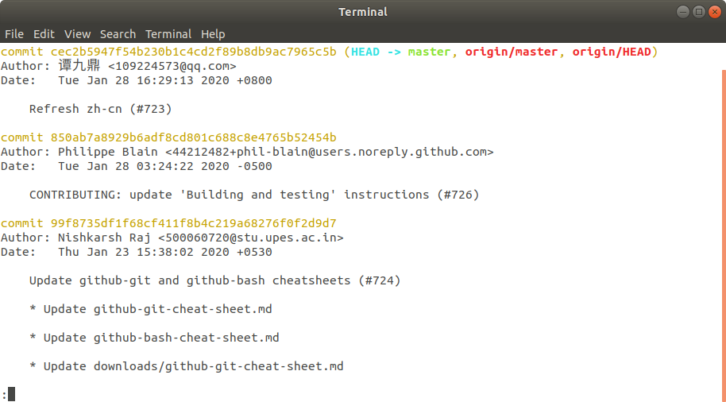
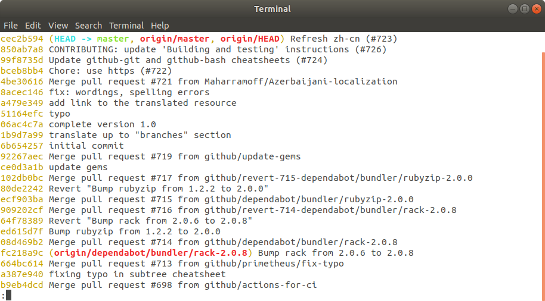
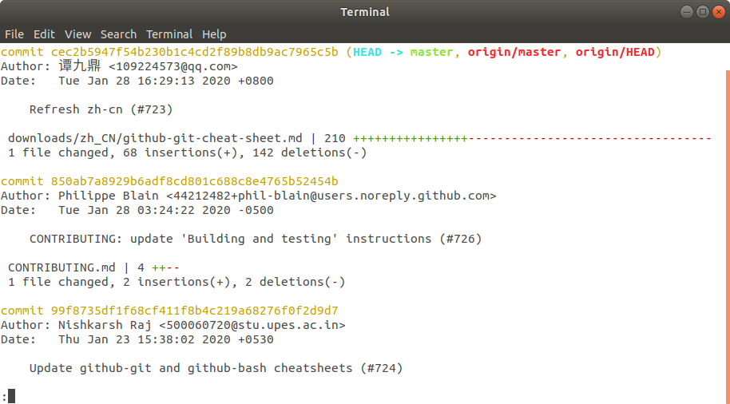
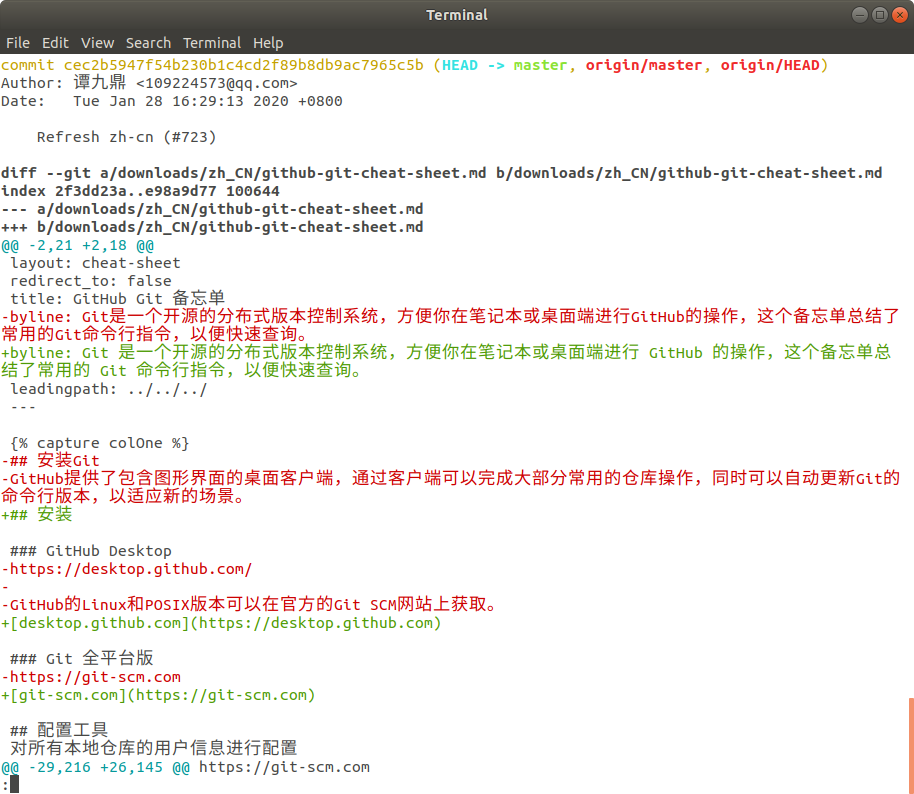

# Analizando el Historial del Repositorio

En esta lección revisaremos los siguientes temas:

 - Mostrar los commits del repositorio

 - Cambiar la forma en que Git Log muestra la información

 - Revisar los archivos modificados

 - Revisar los cambios en los archivos

 - Revisar un commit específico

## Mostrar los commits del repositorio

> En la lección anterior ejecutamos:

>    ```# cd ~/axity-git-course/training-kit```
>    ```# git status```

> Dónde la salida nos mostró lo siguiente:

>    ```On branch master```
>    ```Your branch is up to date with 'origin/master'.```
>    ```nothing to commit, working tree clean```

En este punto no podemos saber qué cambios se hicieron sobre los archivos de este repositorio.

Para conocer todos los cambios realizados sobre el repositorio, ejecutar el siguiente comando:

    $ cd ~/axity-git-course/training-kit
    $ git log

Como resultado podemos ver todo el historial de cambios realizado a los archivos:



Por defecto este comando muestra la siguiente información:

-   SHA
-   El autor
-   Fecha
-   Mensaje

Para navegar a través del log podemos usar las siguientes teclas:

-   scroll **down**
    -   `j` o `↓` para moverse hacia abajo una línea a la vez
    -   `d` para moverse cada mitad de página
    -   `f` para moverse una página entera
-   scroll **up**
    -   `k` o `↑` para moverse hacia arriba una línea a la vez
    -   `u` para moverse cada mitad de página
    -   `b` para moverse una página entera

 - `q` para **salir** del log

## Cambiar la forma en que Git Log muestra la información

El comando `git log` tiene la opción `--oneline` la cual permite modificar la forma en que se muestra la información por defecto.

Ejecutar el siguiente comando para ver su comportamiento:

    # git log --oneline



En resumen, `git log --oneline`:

 - Lista los commits por línea
 - Muestra solo los primero 7 caracteres del SHA
 - Muestra el mensaje del commit

## Revisar los archivos modificados

El comando `git log` tiene otra opción, `--stat` (statistics) para mostrar los archivos que han sido modificados dentro del commit. También muestra información sobre el número de líneas agregadas o eliminadas.

Ejecutar el siguiente comando para ver su comportamiento:

    $ git log --stat



En resumen, `git log --stat`:

 - Los archivos modificados
 - Número de líneas agregadas o eliminadas
 - Resumen de los archivos y líneas que fueron agregados o eliminados

## Revisar los cambios en los archivos

Otra opción del comando `git log` es, `--patch` o su abreviación `-p`, para mostrar información más detallada sobre los cambios realizados a los archivos.

Ejecutar el siguiente comando para ver su comportamiento:

    $ git log -p

   ó

    $ git log --patch



> Otra opción es `git log -p -w` para omitir los cambios de espacios en blanco

En resumen, `git log --patch` muestra:

 - Los archivos que han sido modificados
 - La ubicación de las líneas que han sido agregadas o eliminadas
 - Los cambios que han sido aplicados

## Revisar un commit específico

Hemos visto que `git log` nos proporciona información sobre los cambios hechos a los archivos dentro de un repositorio de Git.

¿Pero cómo podemos obtener información de un commit específico?

    $ git log -p 15bc8f5

Otro comando que permite obtener la misma información es con el siguiente comando:

    $ git show

Este solo muestra información del último commit.

Para obtener información de un commit específico:

    $ git show 15bc8f5

A diferencia de `git log`, el comando `git show` puede ser combinado con las opciones `--stat`, `--patch` o `-p`, `-w`.
