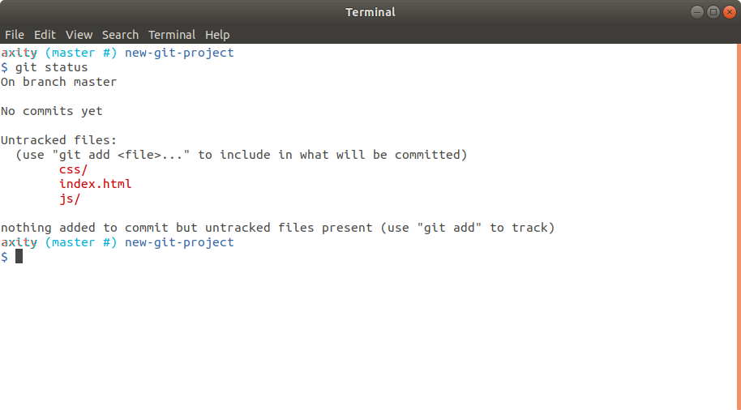
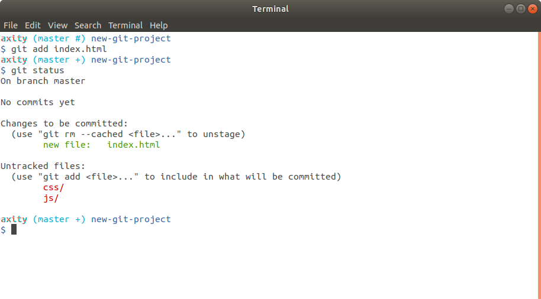
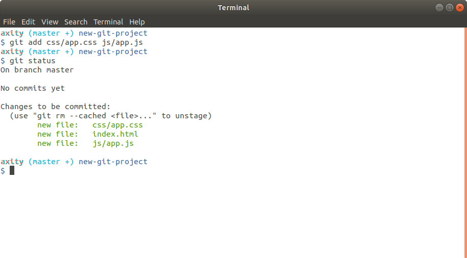
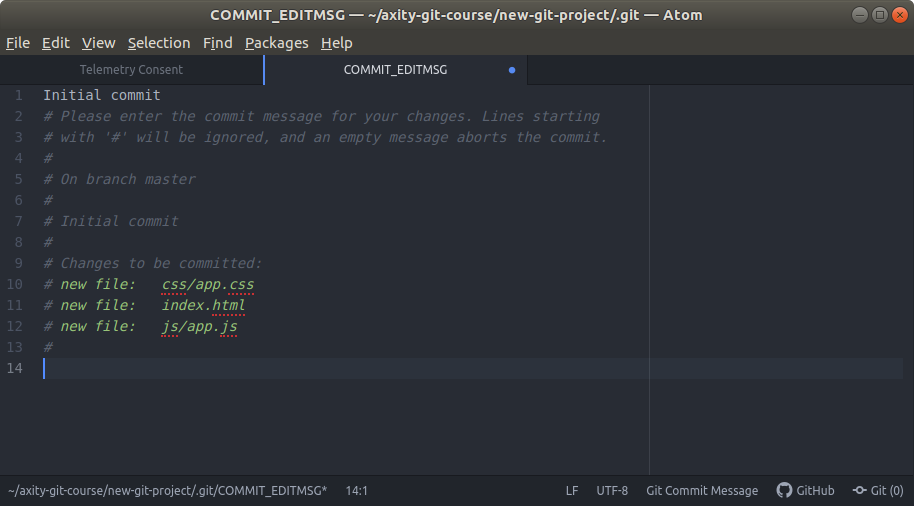
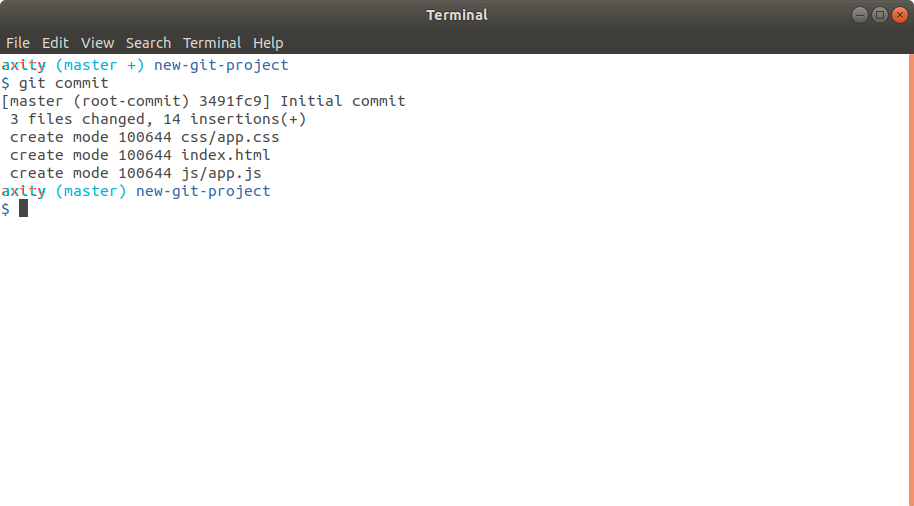
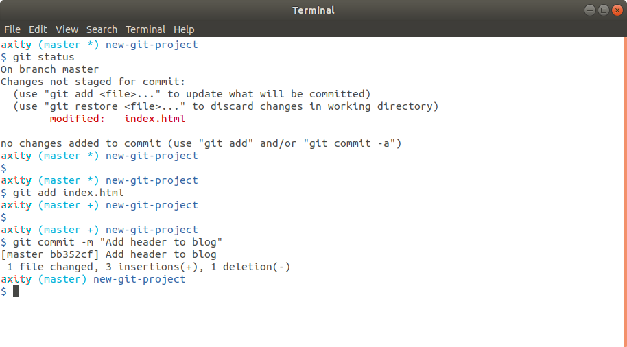
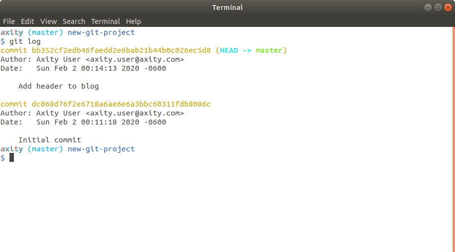
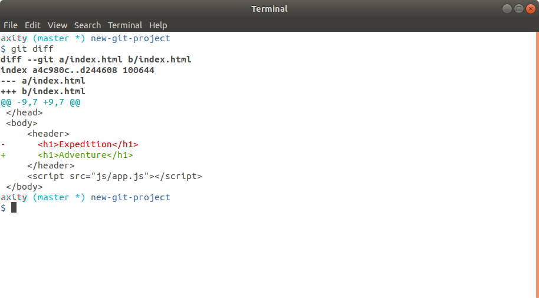
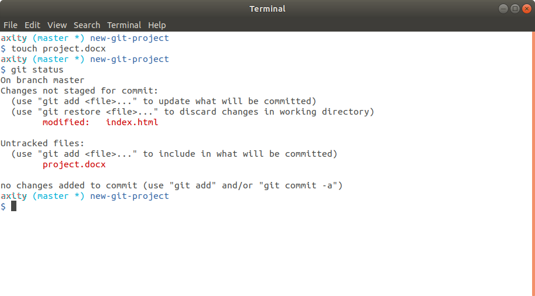
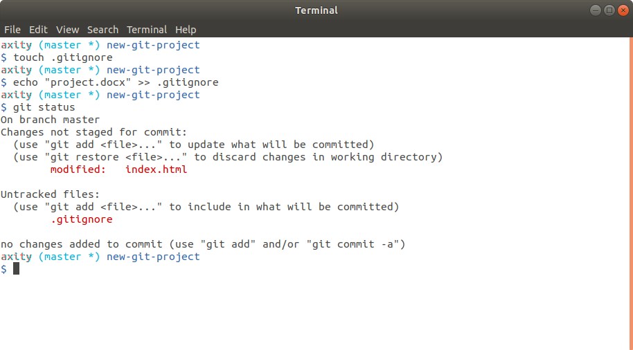

# Agregando commits al repositorio

En esta lección veremos cómo:

 - Empezar a utilizar nuestro repositorio

 - Agregar commits

 - Mensajes de un commit

 - Revisar lo que ha cambiado

 - Omitir archivos en Git

## Empezar a utilizar nuestro repositorio

Antes de empezar a trabajar en nuestro repositorio debemos movernos al directorio `new-git-project`

```bash
$ cd ~/axity-git-course/new-git-project/
```
Posteriormente ejecutar el comando:

```bash
$ git status
```
```bash
On branch master

Initial commit

nothing to commit (create/copy files and use "git add" to track)
```

### Crear un archivo HTML

Ahora creamos un archivo `index.html`
```bash
    $ touch index.html
```
Dentro del archivo `index.html` debemos incluir el siguiente código:

```html
<!doctype html>
<html lang="en">
<head>
    <meta charset="utf-8">
    <title>Blog Project</title>
    <meta name="viewport" content="width=device-width, initial-scale=1">
    <meta name="description" content="">
    <link rel="stylesheet" href="css/app.css">
</head>
<body>

    <script src="js/app.js"></script>
</body>
</html>
```

> Podemos ver que en código hace referencia a un archivo CSS  y otro  de JavaScript.

Adicional debemos:
 - crear el directorio `css` y dentro de él crear el archivo `app.css`
 - crear el directorio `js` y dentro de él crear el archivo `app.js`

```bash
$ mkdir css
$ mkdir js
$ touch css/app.css
$ touch js/app.js
```

Revisamos el estatus del repositorio después de crear directorios y archivos:

```bash
$ git status
```


#### ¿Qué significa esto?


Para agregar el archivo `index.html` al Staging Index, debemos ejecutar el comando:
```bash
$ git add index.html
```
Revisamos nuevamente el estatus del repositorio:
```bash
$ git status
```


Para mover el resto de los archivos al Staging Index, ejecutamos el siguiente comando:

```bash
$ git add css/app.css js/app.js

# otra opción sería:
$ git add .
```

Volvemos a revisar el estatus del repositorio:

```bash
$ git status
```



Podemos observar que ahora todos los archivos se encuentran en el Staging Index.

> Si por error agregamos un archivo al Staging Index y queremos devolverlo, podemos usar el comando `git rm --cached <file1> <file2>...`

### Aprovechar el poder del comando `git status`

> En este punto ya podemos identificar que `git status` es un comando bastante útil. Siempre debemos tenerlo en mente antes y después de cualquier otro comando de Git.

## Agregar commits

> Antes de avanzar, debemos estar seguros de haber configurado el editor por defecto de Git, ya que a partir de aquí lo usaremos para editar los mensajes de los commits.

Para hacer nuestro primer commit debemos ejecutar el siguiente comando:
```bash
$ git commit
```
> Observemos el caracter `*` en el prompt `(master *)`. Esto indica que existen cambios que no hay sido enviados a un commit.

El comando `git commit` abrirá `Atom` donde podemos ingresar el mensaje del commit. Este mensaje deberá describir el cambio que se está realizando.



En este caso ingresaremos el mensaje `Initial commit`. Pero tú puedes ingresar el mensaje que desees.

Guardamos el archivo y cerramos Atom. Esto nos devolverá a la terminal con el siguiente resultado.



Ahora veamos otra forma de hacer commit.

Para esto haremos una segunda modificación al archivo `index.html` agregando las siguientes líneas dentro del bloque `<body>`:

```html
<header>
    <h1>Expedition</h1>
</header>
```

Guardamos el archivo.

Ejecutamos `git add` para agregar el cambio al Staging Index.

Ejecutamos `git commit` con la opción `-m`:

```bash
$ git commit -m "Add header to blog"
```



> Notemos que cuando usamos la opción `-m` podemos mandar el mensaje de forma directa al `commit` sin pasar por el editor por default.

Ahora podemos ejecutar `git log` para ver nuestros commits que hemos registrado:

```bash
$ git log
```



## Mensajes de un commit

Un commit debe registrar un solo cambio. Esto no es limitante para que un commit pueda registrar un cambio en varias líneas de código o varios archivos. Por ejemplo, imaginemos que decidimos cambiar el fondo de nuestra página web, esto requeriría:

 - agregar una nueva imagen
 - modificar el código html
 - agregar o modificar archivos de estilo (css)

Un solo commit que registre todos estos cambios debería estar bien.

### La primera línea del mensaje lo dice todo

Un mensaje de commit **debe**:
 - contener un mensaje corto de menos de 60 caracteres (50 es el recomendable)
 - explicar lo que el commit hace, no el *cómo* o el *por qué*

Un mensaje de commit **no debe**:
 - Explicar el cómo o el por qué (`git log -p` hace eso)
 - contener la palabra **y**, si esto sucede es probable que se estén realizando varios cambios por lo que es recomendable separarlos diferentes commits

Para definir un buen mensaje de commit podemos referirnos a los siguientes recursos:

https://chris.beams.io/posts/git-commit/

https://udacity.github.io/git-styleguide/

## Revisar lo que ha cambiado

El comando `git diff` puede ser usado para ver los cambios que se han hecho, pero a los que no se les ha hecho commit.

Para entender la funcionalidad de este comando realicemos en siguiente cambio en el archivo `index.html`:

En el tag (``<h1>``), cambiar el título de **Expedition** a **Adventure**:

Anterior:
```html
<header>
<h1>Expedition</h1>
</header>
```
Nuevo:
```html
<header>
<h1>Adventure</h1>
</header>
```
Guardar y cerrar el archivo.

Ejecutamos el comando:

```bash
$ git diff
```



Como podemos ver `git diff` muestra los cambios antes de hacer `git commit`.

> Realizar commit antes de continuar definiendo un mensaje, un ejemplo puede ser `Change the travel type`

## Omitir archivos en Git

Recordemos en lecciones anteriores el comando `git add .`

`git add .` agrega todos los archivos que han sido creados o modificados al **Staging Index**. Pero:

 - ¿qué pasa si no queremos que todos sean agregados?

 - ¿cómo puedo ignorar archivos específicos?

 - ¿Cómo puedo evitar que Git lleve el registro de cambios a archivos puntuales?

Imaginemos que creamos un archivo `project.docx` que no deseamos que sus cambios sean registrados por Git:

```bash
$ touch project.docx
```
Ahora ejecutamos:
```bash
$ git status
```



Aquí podemos observar que Git está llevando un registro del archivo `project.docx`.

Ahora, para indicarle a Git que omita los cambios de del archivo `project.docx` necesitamos hacer los siguiente:

 - Crear un archivo llamado `.gitignore` (nótese que incluye un punto al inicio):

```bash
$ touch .gitignore
```
 - Agregar la línea `project.docx` al archivo `.gitignore`:

```bash
$ echo "project.docx" >> .gitignore
```
> También podemos usar un editor para agregar la línea del comando anterior.

 - Ejecutamos `git status` para comprobar que para `project.docx` **Git** no registra los cambios:
```bash
$ git status
```



Dentro del archivo `.gitignore` podemos usar algunos caracteres especiales para definir patrones de grupos de archivos, por ejemplo:

-   líneas en blanco para espaciado
-   `#` - comentar una línea
-   `*` - coincidir 0 o más caracteres
  - *.png -> image1.png, picture.png, box.png
-   `?` - coincidir 1 caracter
    -  `be?rs` **->** bears, beers
-   `[abc]` - coincidir a, b _o_ c
-   `**` - coincidir directorios anidados: `a/**/z` coincide con:
    -   a/z
    -   a/b/z
    -   a/b/c/z

Para mayor referencia, consultar el siguiente enlace:
https://en.wikipedia.org/wiki/Glob_(programming)

 - Agregamos el archivo `.gitignore` al Staging Index:
```bash
$ git add .gitignore
```
 - Hacemos commit:
```bash
$ git commit -m "Add .gitignore file"
```
 - Por último, ejecutamos `git log` para revisar los cambios realizados:
```bash
$ git log
```
