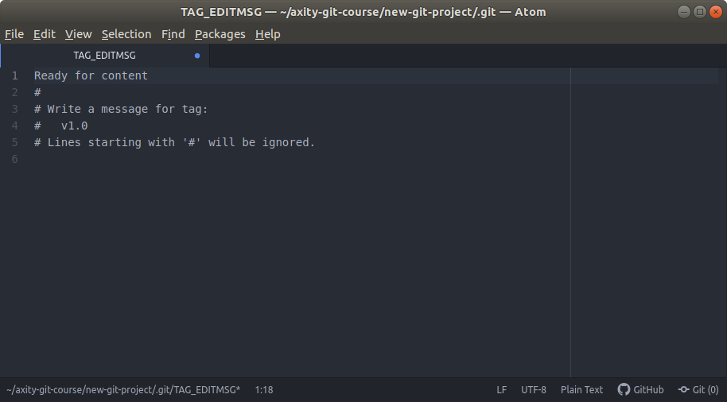
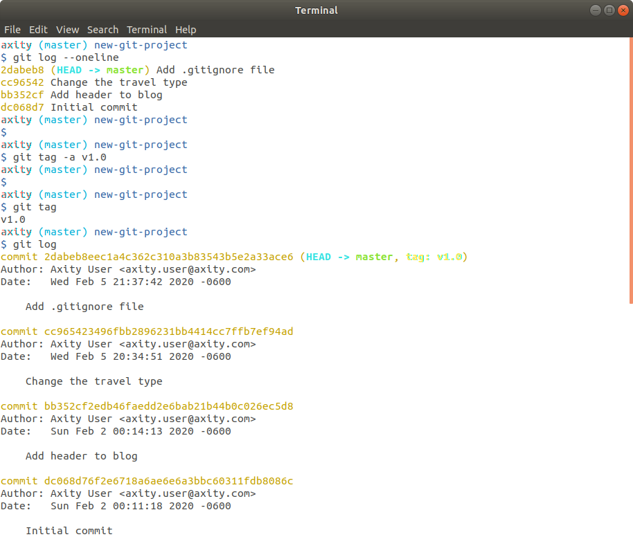
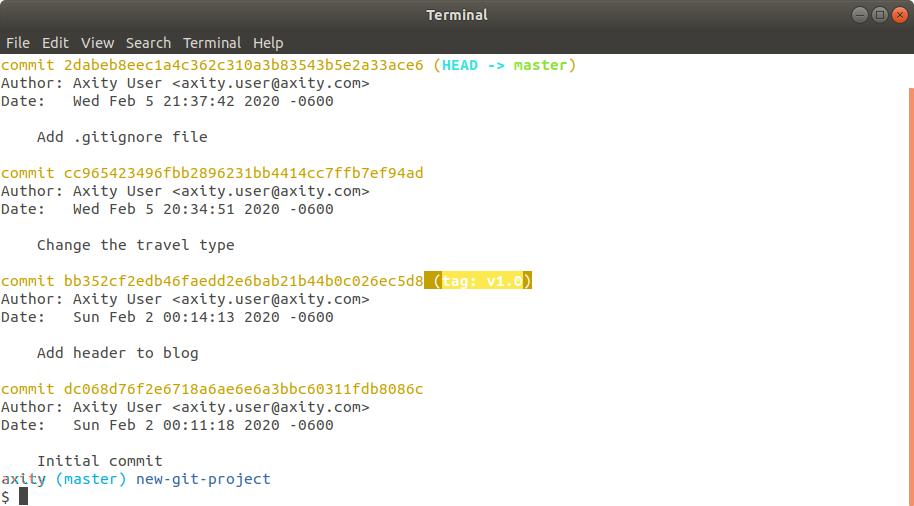
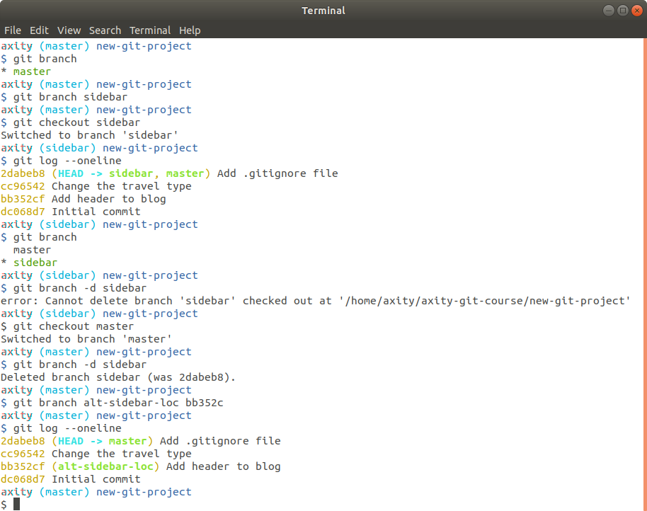

# Tagging & Branching

En esta lección veremos cómo:

 - Vistazo general

 - Crear Tag's

 - Crear Branches

 - Cambiar entre Branches

 - Administrar branches

 - Práctica

## Vistazo general
En esta lección veremos los siguientes comandos:
 - `git tag` para agregar etiquetas a commits específicos; un tag es una etiqueta/apuntador/marcador que nos permite identificar un punto del desarrollo, por ejemplo, una versión beta.
 - `git branch` para generar ramas las cuales pueden estar asociadas a diferentes características de un proyecto que se desarrollan en paralelo.
 - `git checkout` el cual nos permite movernos entre los diferentes  branches y tag's
 - `git merge` para combinar los cambios realizados en diferentes branches de forma automática

**Video >>> (dar clic)**

[](http://www.youtube.com/watch?v=D4VdXT72ASE "Git Tag")

## Crear un Tag

### Crear un tag en el punto actual

Continuando con nuestro repositorio `new-git-project` crearemos un **tag** con el siguiente comando:

```bash
$ git tag -a v1.0
```
Esto abrirá el editor por defecto para poder generar un mensaje para el **tag**, en este caso ingresaremos el mensaje `Ready for content`.

Después de esto guardamos y cerramos el editor.



> Se recomienda el uso de la opción `-a` ya que esta incluirá información adicional como:
>
> - la persona que generó el tag
> - la fecha en que fue realizado
> - el mensaje del tag
>
> si no se incluye la opción `-a` entonces se creará un **tag ligero**

Para verificar que el **tag** se ha creado e identificar el punto (SHA) donde se ha creado el tag ejecutamos:

```bash
$ git tag -a v1.0
$ git log
```



### Borrar un tag

Para borrar un **tag** ejecutamos:
```bash
$ git tag -d v1.0
```
> Otra opción es: `git tag --delete v1.0`

### Agregar un tag a un commit pasado

Si queremos agregar un **tag** sobre un **commit** específico (por ejemplo, apuntando al SHA asociado al commit **Add header to blog**) ejecutamos el siguiente comando:
```bash
$ git tag -a v1.0 bb352c
$ git log
```



> Para efectos de las lecciones siguientes debemos eliminar el tag que hemos creado previamente.

## Crear Branches

El siguiente video explica de forma general cómo funcionan los branches:

**Video >>> (dar clic)**

[](http://www.youtube.com/watch?v=ywcOC6CLG4s "Git Branches")

El comando que usaremos para administrar los branches es `git branch`.

### Visualizar los branches existentes

```bash
$ git branch
```

### Crear un nuevo branch

```bash
$ git branch sidebar
```

## Cambiar entre branches

```bash
$ git checkout sidebar
```
> Es importante entender que cuando hacemos `git checkout`, todos los archivos del repositorio de trabajo son removidos y en su lugar son colocados los archivos que cuyos **commits** corresponden al **branch** sobre el cual estamos haciendo **checkout**.

## Administrar branches

### Visualizar los branches en el log

```bash
$ git log --oneline
```

### Visualizar el branch activo

```bash
$ git branch
```

### Eliminar un branch

```bash
$ git branch -d sidebar
```

### Crear un branch en un commit específico

```bash
$ git branch alt-sidebar-loc bb352c
```



# [**Práctica 07**](Práctica%2007%20-%20Commits.md#ejercicio---commits)
