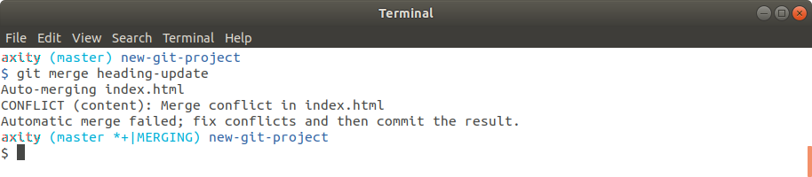
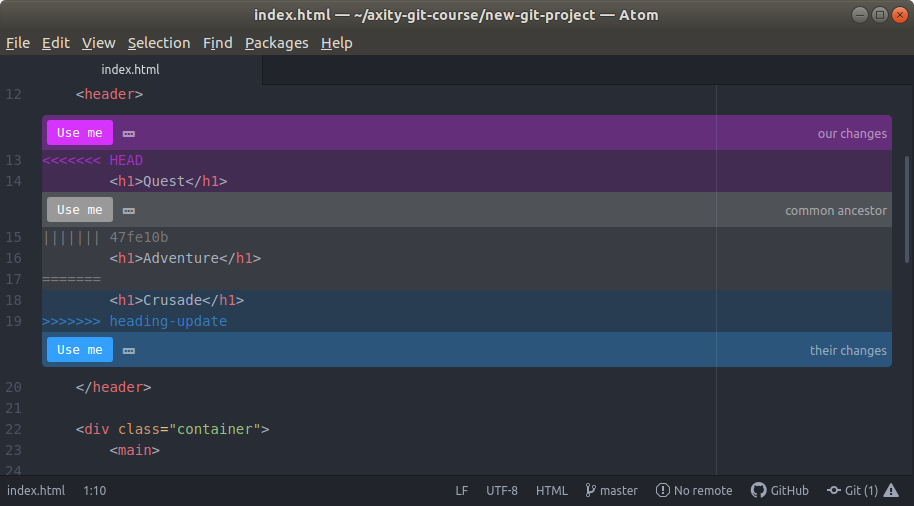
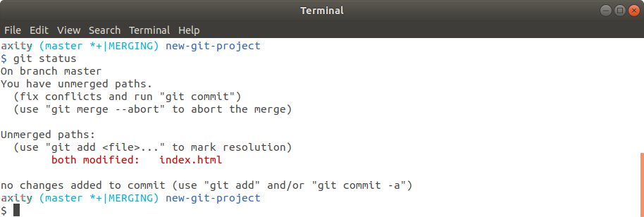
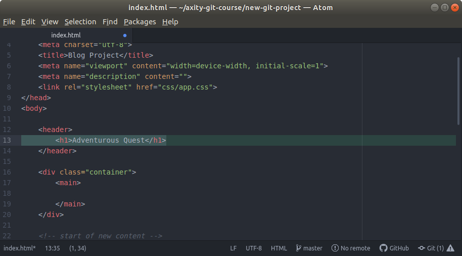
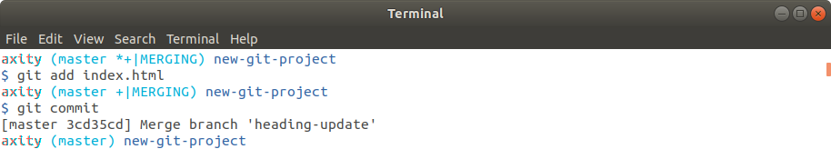
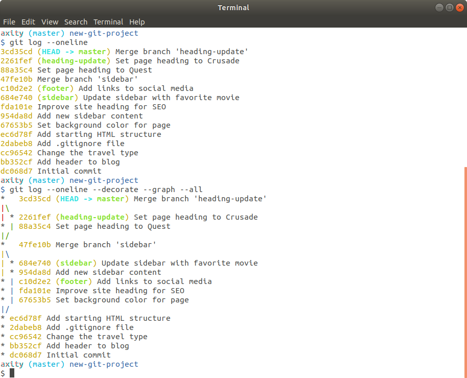

# Manejando conflictos durante un merge

 - Un conflicto durante un merge puede ocurrir cuando una misma línea en un archivo es modificada en dos o más branches por separado. Por ejemplo, si dos personas realizan un cambio sobre el texto del título de la página web en diferentes branches.

 - En estos casos Git no puede determinar de forma automática cual línea conservar y cual eliminar.

## Forzar a un conflicto en merge

### Práctica 09 - Simular un conflicto en merge

Para simular un conflicto durante un merge y aprender cómo manejar este tipo de conflicto realizaremos los siguientes pasos:

> Recuerda realizar commit después de cada paso.

 1. En el archivo `index.html`, cambiar el encabezado `Adventure` por `Quest` en el branch `master`. Mensaje: `Set page heading to Quest`.

 2. Crear el branch `heading-update` apuntado al penúltimo commit (el penúltimo commit debe estar asociado al mensaje `Merge branch 'sidebar'`). Este cambio debe ser hecho sobre el branch `heading-update`.

 3. En el archivo `index.html`, cambiar el encabezado `Adventure` por `Crusade` en el branch `heading-update`. Mensaje: `Set page heading to Crusade`.

 4. Establecer `master` como el branch activo.

 5. Ejecutar el comando de `merge`:

```bash
$ git merge heading-update
```

El resultado debería verse como sigue:



Este mensaje indica que **Git** no pudo realizar un merge automático y que debemos resolver estos conflictos de forma manual.

 6. Abrir el archivo `index.html` en Atom.



> Aquí podemos observar los siguientes indicadores de conflicto durante
> el merge:
>
> -   `<<<<<<< HEAD` todo lo que está después de este indicado (hasta antes del siguiente) corresponde al branch actual.
> -   `||||||| merged common ancestors` todo lo que está después de este indicador (hasta antes del siguiente) muestra las líneas originales
> antes de realizar el merge.
> -   `=======` indica el final de las líneas originales y todo lo que está después de este indicador (hasta antes del siguiente) muestra las
> líneas del branch sobre el que se está aplicando el merge.
> -   `>>>>>>> heading-update` indica el final de las líneas del branch sobre el que se está aplicando el merge.

 7. Ejecutar el comando de `status` para conocer las acciones pendientes.

```bash
$ git status
```



 8. Para resolver estos conflictos solo debemos conservar la línea de código que deseamos mantener y eliminar las líneas de los indicadores. Veamos lo que sucede si no mantenemos ninguno de los dos cambios y en este punto cambiamos el texto del encabezado por `Adventurous Quest`



 9. Realizamos `commit`  con el mensaje por defecto.



10. Usar `git log --oneline` para ver el historial de commits.


