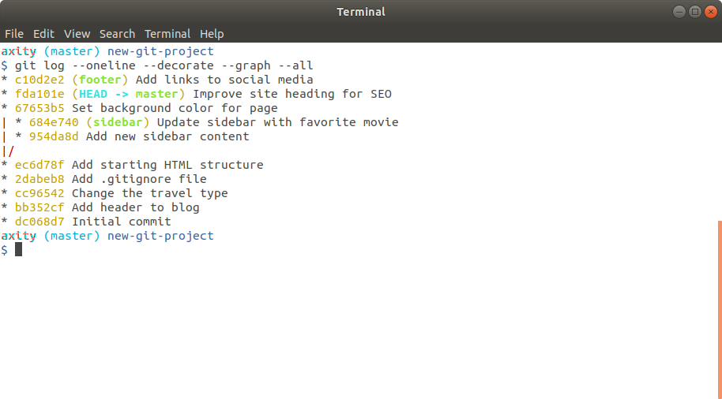

# Práctica 07 - Commits
## Antes de comenzar

Antes de comenzar, debemos asegurarnos de los siguiente:

 - Estar ubicado en el proyecto/directorio `new-git-project` y asegurar que existen los siguientes archivos:

    -   `index.html`
    -   `css/app.css` (vacío)
    -   `js/app.js` (vacío)

 - El archivo `index.html` contiene el siguiente código:

```html
<!doctype html>
<html lang="en">
<head>
    <meta charset="utf-8">
    <title>Blog Project</title>
    <meta name="viewport" content="width=device-width, initial-scale=1">
    <meta name="description" content="">
    <link rel="stylesheet" href="css/app.css">
</head>
<body>

    <header>
        <h1>Expedition</h1>
    </header>

    <div class="container">
        <main>

        </main>
    </div>

    <footer>
        Made with ♥ @ Axity
    </footer>
    <script src="js/app.js"></script>
</body>
</html>
```

 - Todos los archivos han sido agregados al Staging Index y se ha realizado un commit.

 - El único branch es master. Si existen otros branches, asegurar que han sido borrados.

 - Al ejecutar `git status,` la salida debe indicar que el directorio de trabajo está limpio (`working directory clean`).

## Pasos a seguir

### 1. Agregar un color a la página

1. En el branch `master` agregar el siguiente contenido dentro del archivo `css/app.css`:

```css
body {
    background-color: #00cae4;
}
```

2. Guardar el archivo y cerrar.

3. Realizar `commit`  con el mensaje `Add starting HTML structure`.

4. Usar `git log --oneline` para ver el historial de commits.

### 2. Agregar barra lateral

1. Crear un `branch` llamado `sidebar` apuntando al **SHA** asociado al commit del mensaje `Add starting HTML structure`.

2. Realizar `checkout` para cambiar al branch `slidebar`.

3. Usar `git log --oneline` para ver el historial de commits.

> Verificar que los commits realizados en el branch `master` no aparecen en `sidebar`.


> Podemos abrir el archivo   `css/app.css` en Atom y posteriormente cambiar entre el branch `master` y `slidebar` para poder observar cómo se actualiza el contenido en las diferentes versiones del archivo.

4. Crear una barra lateral. Para hacer esto se debe asegurar que el branch activo es `sidebar` y agregar el código del bloque `<aside>` al archivo HTML:

```html
<div class="container">
    <main>

    </main>
</div>

<!-- start of new content -->
<aside>
    <h2>About Me</h2>

    <p>Lorem ipsum dolor sit amet, consectetur adipisicing elit. Eos, debitis earum molestias veniam suscipit aliquam totam exercitationem tempore neque vitae. Minima, corporis pariatur facere at quo porro beatae similique! Odit.</p>
</aside>
<!-- end of new content -->

<footer>
    Made with ♥ @ Axity
</footer>
```

> Podemos personalizar el contenido del bloque si se desea.

5. Guardar y cerrar.
6. Realizar `commit`  con el mensaje `Add new sidebar content`.

### 3. Cambiar el encabezado en `master`

1. Realizar `checkout` para cambiar al branch `master`.

2. En el archivo `index.html` cambiar el texto del encabezado `<h1>` de `Expedition` a `Adventure`

3. Guardar y cerrar.

4. Realizar `commit`  con el mensaje `Improve site heading for SEO`.

### 4. Agregar más contenido a la barra lateral

1. Realizar `checkout` para cambiar al branch `sidebar`.

> Verificar que los commits realizados en el branch `master` no aparecen en `sidebar`.

2. En el archivo `index.html` agregar algún contenido en el bloque `<p>` del bloque `<aside>`. Algo como `My favorite movie is LOTR!`.

3. Guardar y cerrar.

4. Realizar `commit`  con el mensaje `Update sidebar with favorite movie`.

### 5. Agregar enlaces de redes sociales al pie de página

1. Crear un branch llamado `footer` basado en el branch `master`. Para hacer esto podemos ejecutar:

```bash
$ git checkout -b footer master
```
2. Ejecutar `git log --oneline` para observar el efecto de esta acción.

3. Agregar enlaces de redes sociales. En el archivo `index.html` agregar el siguiente código dentro del bloque `<footer>`.

```html
<footer>
    <!-- start of new content -->
    <section>
        <h3 class="visuallyhidden">Social Links</h3>
        <a class="social-link" href="https://twitter.com/axity_social">
            
        </a>
        <a class="social-link" href="https://https://www.instagram.com/Axity_Social">
            
        </a>
        <a class="social-link" href="https://www.linkedin.com/company/axity">
            
        </a>
    </section>
    <!-- end of new content -->
</footer>
```

> Modificar los enlaces a redes sociales si se desea.

4. Guardar y cerrar.

5. Realizar `commit`  con el mensaje `Add links to social media`.

### 6. Ver todos los branches
1. Ejecutar el siguiente comando para ver toda la actividad histórica de los commits realizados en todos los branch:

```bash
$ git log --oneline --decorate --graph --all
```

2. El resultado debe ser algo similar a lo siguiente:


